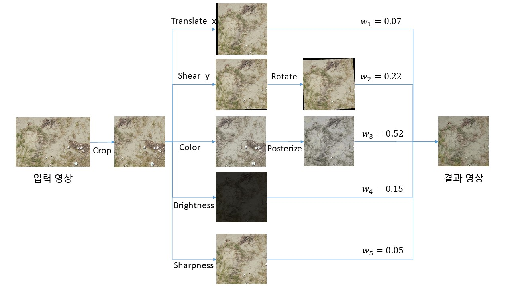

# MarineLitterHackathon
By using drone, AI, and Bigdata technology, we can manage the marine litter problem more efficiently. Here I present how to use data augmentation for improving the robustness of deep-learning model to prepare the noise from sea environment.

* [Hackathon Link](https://www.contestkorea.com/sub/view.php?displayrow=20&int_gbn=1&Txt_sGn=2&Txt_year=2021&Txt_month=9&Txt_day=18&Txt_code1=&Txt_aarea=&Txt_area=&Txt_sortkey=a.int_sort&Txt_sortword=desc&Txt_bcode=030220003&str_no=202109080032) 

## AugMix

[Augmix](https://arxiv.org/pdf/1912.02781.pdf) is a new data processing technique that chooses multiple augmentations randomly with dirichelet distribution,mixes augmented images and enforces consistent embeddings of the augmented images, which results in increased robustness and improved uncertainty calibration. This
technique achieves much better results as compared to other augmentation techniques. Not only it improves the accuracy of the
models' confidence, but also contributes in improving the robustness of the models.
  
This repo is based on [official code](https://github.com/google-research/augmix) and shows how to use in custom dataset and visualize. 

### SeaAugMix Algorithm Overview
<p align="left"> 


## Requirements
Python>=3.6.x<br>
numpy>= 1.17<br>
Pillow>=6.2<br>

## Usage:
Since this repo is a simple usage of augmentation based on image processing method, I recommend either `anaconda` or `virtualenv`.

1. Clone this and [Augmix](https://github.com/google-research/augmix) repo
2. `pip install requirements.txt`
3. Add augmentations.py and augment_and_mix.py from [Augmix](https://github.com/google-research/augmix) to 'src' folder in this repo.
4. Fix IMAGE_SIZE in augmentations.py, width and height in AugMixVisualization.py for custom dataset
5. `python AugMixVisualization.py`


## Citation
```
@article{hendrycks2020augmix,
  title={{AugMix}: A Simple Data Processing Method to Improve Robustness and Uncertainty},
  author={Hendrycks, Dan and Mu, Norman and Cubuk, Ekin D. and Zoph, Barret and Gilmer, Justin and Lakshminarayanan, Balaji},
  journal={Proceedings of the International Conference on Learning Representations (ICLR)},
  year={2020}
}
```

